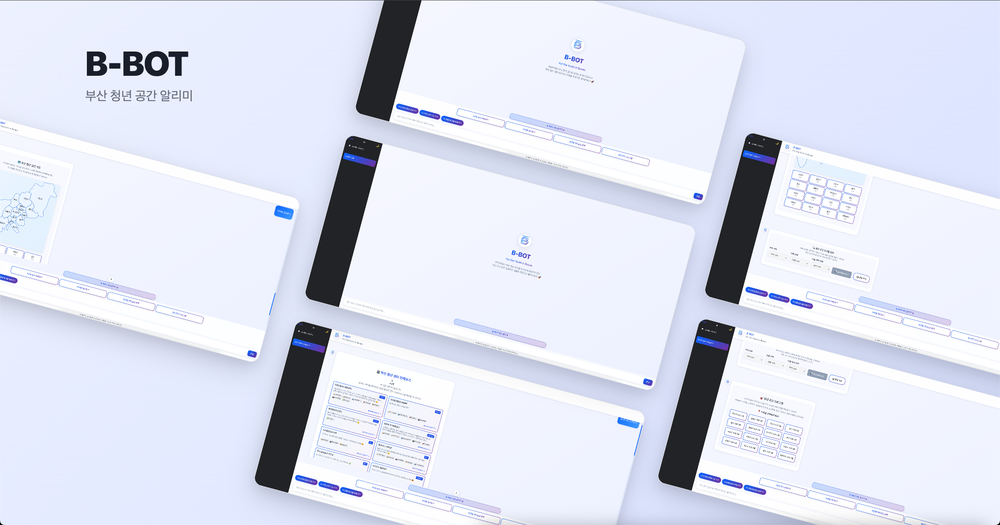

### 부산 청년 공간 알리미 B-BOT

  <h1>B-BOT 부산 청년 공간 알리미</h1>
  
🔍 LLM 기반 공간 알리미 챗봇 서비스 🔍

  <a href="https://kt-busan.github.io/busan-chatbot-frontend/">홈페이지</a>

 

  

 

---

## 소개

- **목표** : 부산 지역 청년들에게 공간·프로그램 정보를 대화형으로 제공  
- **구성** : Frontend(React + Vite, GitHub Actions) + Backend(Flask 3.x, SQLite, Render)  
- **데이터 품질** : 크롤러 기반 최신화 + **Override 병합** + 캐시 최적화  
- **응답 품질** : 규칙/키워드 매칭과 **자연어 응답(OpenAI)** 하이브리드

---

## 주요 기능

- **대화형 검색** : 키워드·지역·주제 기반 탐색, 버튼/지도 연동
- **최신화 파이프라인** : BeautifulSoup 크롤러 + 캐시/백오프
- **정확도 향상** : 운영자 **오버라이드 JSON**으로 필드 교정
- **접근성/테마** : 다크모드, 반응형, 키보드 네비게이션 고려
- **배포 자동화** : GitHub Actions → GitHub Pages / Render

---

## 저장소

- Frontend: React 18, Vite, Axios, ESLint, 다크모드/지도/사이드바
→ busan-chatbot-frontend

- Backend: Flask 3.x, Python 3.12+, SQLAlchemy+SQLite, Requests+BS4, OpenAI 연동, 캐시/오버라이드
→ busan-chatbot-backend

---

## API 개요

- 채팅/히스토리/사용자

    - POST /api/chat, DELETE /api/chat/{chat_id}
    - GET /api/history/{anonymous_id}, GET /api/user/{anonymous_id}, POST /api/user
    - GET /api/users/stats

- 청년공간(Spaces)
    - GET /api/spaces, /region/{region}, /search?keyword=..., /detail/{space_name}
    - POST /api/spaces/crawl, GET /api/spaces/all, /busan-youth
    - GET /api/spaces/cache-data, /keyword-data, /rental-spaces/{center_name}

- 청년 프로그램(Programs)

    - GET /api/programs, /region/{region}, /search?keyword=...
    - POST /api/programs/crawl

- 운영/Debug/Health

    - GET /api/spaces/overrides/status, POST /api/spaces/overrides/reload
    - GET /api/spaces/overrides/test/{region}, /compare/{space_name}
    - GET /api/debug/spaces-status, POST /api/debug/reload-spaces
    - GET /health, GET /api/health

---

## 운영·품질·보안

- 캐시 전략 : 만료/강제 재로드 엔드포인트, 크롤러 백오프/타임아웃
- 오버라이드 정책 : 운영자 검수 JSON으로 원본 위 덮어쓰기
- 관측 : 요청 로깅, 에러율/캐시 적중률/크롤러 성공률 지표화
- 보안 : CORS 화이트리스트, 환경변수/시크릿 관리, 종단간 타임아웃
- 성능 : 인덱스/페이징, 응답 템플릿화, 프롬프트 길이 최소화
